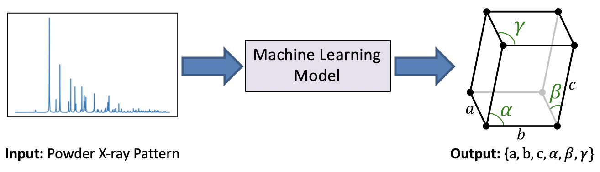

                
### About Me 

I am a fourth-year PhD student at Stanford University and SLAC National Accelerator Laboratory, advised by Professor [Mike Dunne](https://profiles.stanford.edu/Mike-dunne). My primary research focuses on using artifical intelligence to interpret the results of large scale X-ray scattering experiments and designing informative experiments based on probabilistic decision making paradigms. Prior to Stanford, I obtained an MPhil degree in Scientific Computing from Cambridge University under the supervision of Professor [David Wales](https://www.ch.cam.ac.uk/group/wales/person/dw34) and a BA in Chemistry from Pomona College. 

### PhD Projects

#### Accurate Photonizing and Contrast Estimation for X-ray Photon Correlation Spectroscopy

Many important physical processes occur on very (very) short timescales (i.e. on the order of femtoseconds). At the Linac Coherent Light Source (LCLS), we study these phenomena using incredibly bright, pulsed X-rays; one technique is known as X-ray Photon Correlation Spectroscopy. Essentially, the idea is to shoot two sequential X-ray pulses (with variable time-delay) at a sample and obtain two snapshots (X-ray images) of the sample structure at different times. If the X-ray images are the same at both time points, this implies that the structure has not changed between the two pulses. Conversely, if the X-ray images are very different, it implies that something has changed in the sample over that corresponding time-scale. By systematically changing the time-delay we are able to map out very complex processes in materials and create "molecular movies". 

The figure-of-merit for quantifying how two X-ray images are different is known as the contrast. The ultimate goal of our work is, therefore, to accurately estimate the contrast from X-ray detector images. In order to determine the contrast, it is first neccesary to count the number of photons hitting the detector at each pixel. Our input to the model is the raw detector image (which may have significant noise, charge-sharing etc) and our output is a sparse-matrix corresponding to the photon counts at each pixel (photonizing). In the image above, we show that we can accurately photonize the input using a CNN. 

Please check out our [publication](https://aca.scitation.org/doi/10.1063/4.0000161) and [press](https://www6.slac.stanford.edu/news/2022-11-07-artificial-intelligence-deciphers-detector-clouds-accelerate-materials-research) article for further details..

#### Automatic prediction of crystal lattice parameters from powder X-ray Diffraction data

Powder diffraction is a widely used X-ray based method used to study the structure of crystalline materials. These techniques are particularly insightful in allowing us to understand why particular materials have certain physical properties (such as strength, conductivity, stiffness etc). Using this knowledge, we are better able to intelligently design new materials with desired attributes. Currently, the analysis of powder diffraction data can take significant time and human effort, and therefore any efforts to automate this process will be very useful. 

In this project, we develop supervised learning models to predict the shape of the unit-cell of a crystal from simulated data as well as experimental data collected at the Stanford Synchrotron Radiation Lightsource (SSRL). As shown in the image above, the unit-cell shape is fully defined by six numbers, three lengths and three angles, and therefore this problem can be formulated as a standard non-linear regression task with six outputs. Please check out our [publication](http://scripts.iucr.org/cgi-bin/paper?vb5020) for more information.

