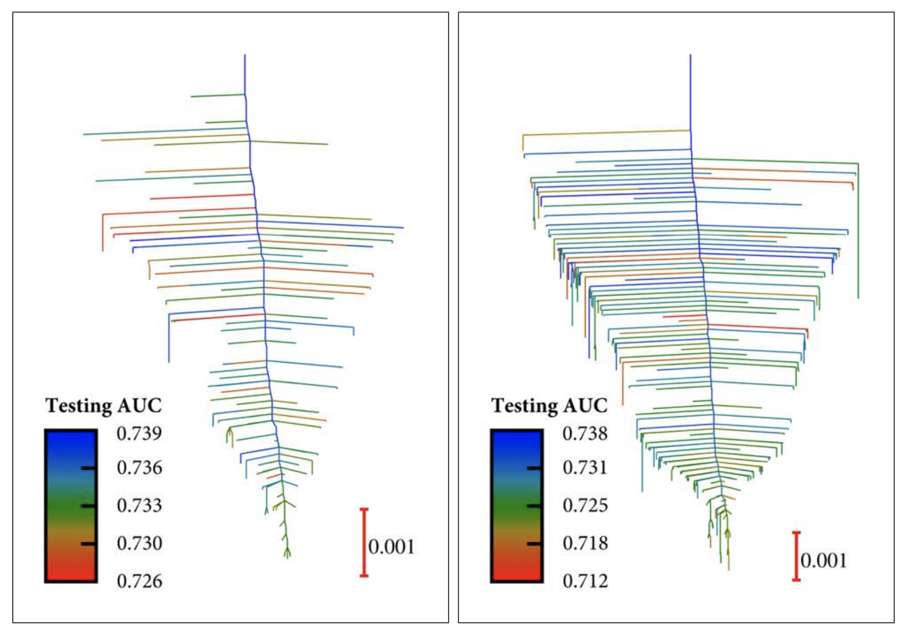
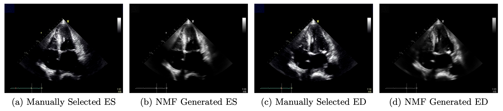

I am a first-year PhD student at Stanford University and the SLAC National Accelerator Laboratory, advised by Professor Mike Dunne. My research focuses on developing automatic data analysis methods for experiments in Chemistry and Materials Science. Prior to Stanford, I obtained an MPhil degree in Scientific Computing from Cambridge University and a BA in Chemistry from Pomona College. 

## Current Projects:

- Automatic prediction of crystal lattice parameters from powder XRD data (coming soon!). 
- Accurate photonizing and contrast estimation for X-ray Photon Correlation Spectroscopy 

## Past Research 

- Neural Network Loss Landscapes 

  
- JPL Research 
- Machine Learning for cardiac ultrasound time-series data 

