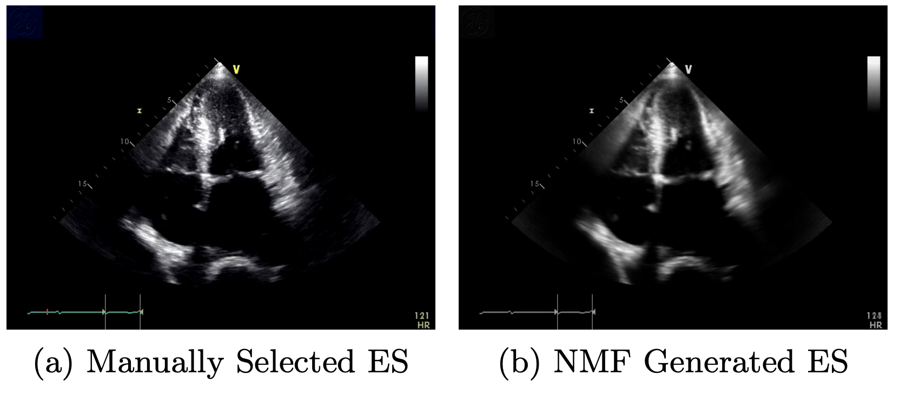

I am a first-year PhD student at Stanford University and SLAC National Accelerator Laboratory, advised by Professor [Mike Dunne](https://profiles.stanford.edu/Mike-dunne). My research focuses on developing automatic data analysis methods for experiments in Chemistry and Materials Science. Prior to Stanford, I obtained an MPhil degree in Scientific Computing from Cambridge University under the supervision of Professor [David Wales](https://en.wikipedia.org/wiki/David_J._Wales) and a BA in Chemistry from Pomona College. 

## Current Projects

### Automatic prediction of crystal lattice parameters from powder XRD data (coming soon!). 

collaborators: Richard Walroth, Vivek Thampy, Kevin Stone, Evan Reed, Mike Dunne, Daniel Ratner, Chris Tassone

#### Accurate photonizing and contrast estimation for X-ray Photon Correlation Spectroscopy 

collaborators: TJ Lane, Daniel Ratner, Yanwen Sun, Diling Zhu, Mike Dunne (PI)

## Past Research 

#### Neural Network Loss Landscapes 

collaborators: Philipp Veepoort, Alpha Lee and David Wales (PI)
   
#### JPL Research 

collaborators: Fred Grieman, Xu Zhang (PI)  

#### Machine Learning for cardiac ultrasound time-series data 

collaborators: Baichuan Yuan, Geoffrey Iyer, Nuoyu Li, Xiaochuan Xu, Ruohan Zhan, Rafael Llerena, Jesse Yen and Andrea  Bertozzi (PI).

